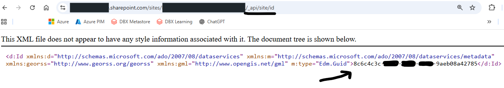
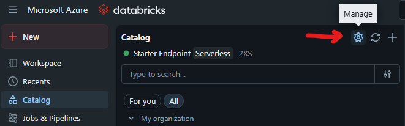

# Lakeflow Connect (SharePoint) + lectura nativa de Excel en Databricks (Spark)

Este tutorial muestra cómo leer **archivos Excel (.xlsx)** en Databricks de dos formas:

1) **Desde un Volume / almacenamiento** usando `spark.read.format("excel")`  
2) **Directo desde SharePoint** usando **Lakeflow Connect for SharePoint** (vía `databricks.connection`)

La idea es simple: **dejar de exportar Excel a CSV**, dejar de bajar archivos “a mano”, y empezar a tratarlos como un input serio para pipelines.

---

## Qué vas a encontrar acá

- Un notebook listo para correr con ejemplos de:
  - ✅ `COPY INTO ... FILEFORMAT = EXCEL`
  - ✅ Auto Loader con `availableNow` (micro-batch)
  - ✅ Auto Loader en streaming continuo (si lo necesitás)
  - ✅ (Opcional) sketch de DLT

📓 Notebook: `sharepoint_excel_lakeflow_connect.ipynb` *(o el nombre que le hayas puesto)*

---

## Requisitos

- Un workspace de Databricks (idealmente con Unity Catalog)
- Acceso para crear **Connections** (Catalog > Connections)
- Un tenant de Microsoft 365 con SharePoint
- Una App / Service Principal en Entra ID (Azure AD) para auth (recomendado para producción)

---

## Paso 0 — Activar features (si aparecen como Preview)

En algunos workspaces estas features aparecen como “Preview” y se activan desde el panel de configuración/preview.

📸 Capturas sugeridas:
- Excel File Format Support:  
  

- Lakeflow Connect for SharePoint:  
  

---

## Paso 1 — (Opcional) Identificar el Site ID de SharePoint

Dependiendo del setup, es común necesitar el identificador del sitio (Site ID).  
Una forma práctica es abrir el endpoint que expone el `id` y copiarlo.

📸 Captura sugerida:  


> Tip: guardate el Site ID porque después lo vas a usar en permisos o validaciones.

---

## Paso 2 — Crear App en Entra ID y permisos (Microsoft Graph)

Para automatizar (y no depender de un usuario), creás una App Registration y le das permisos Graph.

Ejemplo típico (depende del caso):
- `Sites.Read.All`
- `Files.Read.All`

📸 Captura sugerida:  


> Recomendación: en producción, aplicá el mínimo privilegio posible y manejá secrets con un Secret Scope.

---

## Paso 3 — Crear la Connection en Databricks (SharePoint)

En Databricks:
`Catalog` → `Connections` → `Create connection` → **SharePoint**

📸 Captura: dónde crear/gestionar conexiones  


Luego completás:
- Client ID
- Client secret
- Domain
- Tenant ID

📸 Captura: autenticación  


---

## Paso 4 — Probar lectura de Excel (dos caminos)

### A) Excel desde almacenamiento / Volume

```python
df = (spark.read
  .format("excel")
  .option("headerRows", 1)
  .load("/Volumes/<catalog>/<schema>/<volume>/demo.xlsx")
)
display(df)
