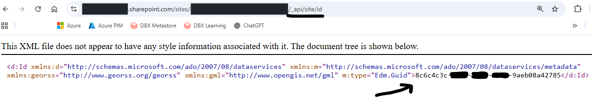
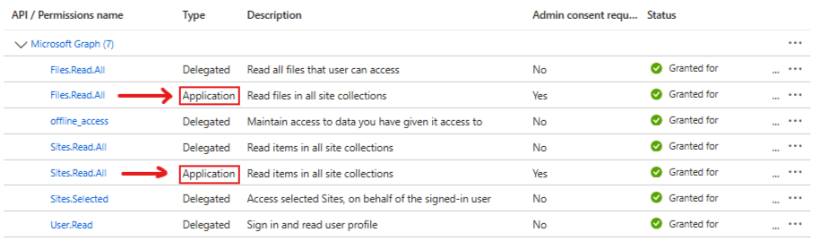
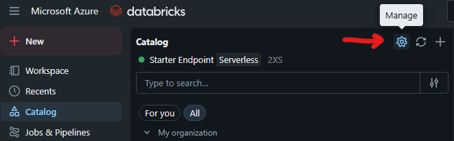
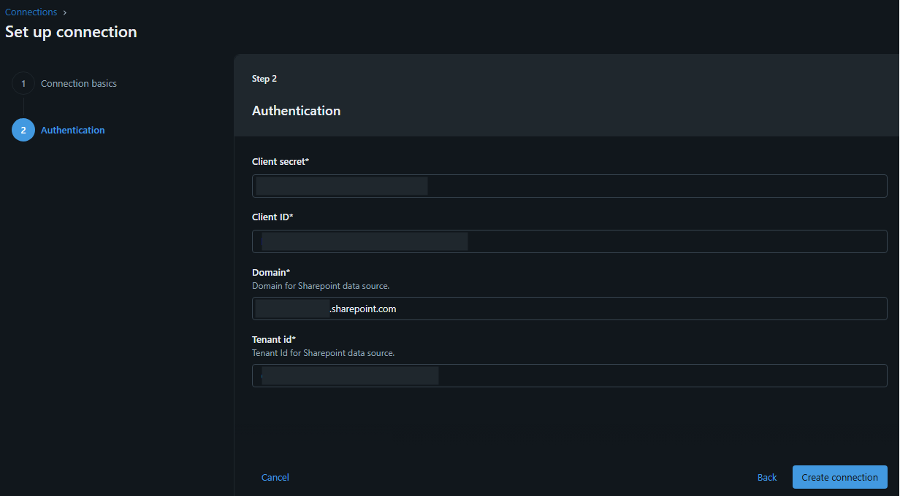

# Lakeflow Connect (SharePoint) + lectura nativa de Excel en Databricks (Spark)

Este tutorial muestra cómo leer **archivos Excel (.xlsx)** en Databricks de dos formas:

1) **Desde un Volume / almacenamiento** usando `spark.read.format("excel")`  
2) **Directo desde SharePoint** usando **Lakeflow Connect for SharePoint** (vía `databricks.connection`)

La idea es simple: **dejar de exportar Excel a CSV**, dejar de bajar archivos “a mano”, y empezar a tratarlos como un input serio para pipelines.

---

## Qué vas a encontrar acá

- Un notebook listo para correr con ejemplos de:
  - ✅ `COPY INTO ... FILEFORMAT = EXCEL`
  - ✅ Auto Loader con `availableNow` (micro-batch)
  - ✅ Auto Loader en streaming continuo (si lo necesitás)
  - ✅ (Opcional) sketch de DLT

📓 Notebook: `excel_y_sharepoint_lakeflow_connect.ipynb`, este notebook de [**acá**](excel_y_sharepoint_lakeflow_connect.ipynb).

---

## Requisitos

- Un workspace de Databricks (idealmente con Unity Catalog)
- Acceso para crear **Connections** (Catalog > Connections)
- Un tenant de Microsoft 365 con SharePoint
- Una App / Service Principal en Entra ID (Azure AD) para auth (recomendado para producción)

---

## Paso 1 — (Opcional) Identificar el Site ID de SharePoint

Dependiendo del setup, es común necesitar el identificador del sitio (Site ID).  
Una forma práctica es abrir el endpoint que expone el `id` y copiarlo.

📸 Captura sugerida:  


> Tip: guardate el Site ID porque después lo vas a usar en permisos o validaciones.

---

## Paso 2 — Crear App en Entra ID y permisos (Microsoft Graph)

Para automatizar (y no depender de un usuario), creás una App Registration y le das permisos Graph.

Ejemplo típico (depende del caso):
- `Sites.Read.All`
- `Files.Read.All`

📸 Por ejemplo para el M2M (machine-to-machine) seria lo siguiente:  


> Recomendación: en producción, aplicá el mínimo privilegio posible y manejá secrets con un Secret Scope.

---

## Paso 3 — Crear la Connection en Databricks (SharePoint)

En Databricks:
`Catalog` → `Connections` → `Create connection` → **SharePoint**

📸 Dónde crear/gestionar conexiones:


Luego completás:
- Client ID
- Client secret
- Domain
- Tenant ID

📸 Autenticación:  


---

## Paso 4 — Probar lectura de Excel (dos caminos)

### A) Excel desde almacenamiento / Volume

```python
df = (spark.read
           .format("excel")
           .option("headerRows", 1)
           .load("/Volumes/<catalog>/<schema>/<volume>/demo_sales.xlsx")
     )

display(df)
```

### B) Excel directo desde SharePoint usando Lakeflow Connect

Una vez creada la **Connection de SharePoint** en Databricks, podés leer archivos Excel directamente desde SharePoint **sin copiarlos previamente a un Volume**.

La clave está en dos cosas:
- usar el formato `excel`
- referenciar la conexión con `databricks.connection`

Ejemplo básico:

```python
df = (
  spark.read
       .format("excel")
       .option("databricks.connection", "<NOMBRE_DE_LA_CONNECTION>")
       .option("headerRows", 1)
       .load("https://<TU_TENANT>.sharepoint.com/sites/<TU_SITE>/Shared%20Documents/<RUTA>/demo_sales.xlsx")
     )

display(df)
```

---

## Archivo Excel de ejemplo

Este tutorial incluye un archivo Excel de ejemplo (`demo_sales.xlsx`) con datos ficticios
para que puedas probar rápidamente desde **Databricks Free Edition**.

Ejemplo de uso:

1) Subí `demo_sales.xlsx` a un Volume o File Store
2) Actualizá la variable `LOCAL_EXCEL_PATH` en el notebook
3) Ejecutá la sección **Opción A — Excel desde Volume**

Las columnas son simples (ventas, fechas, montos) y están pensadas para demos y POCs.

